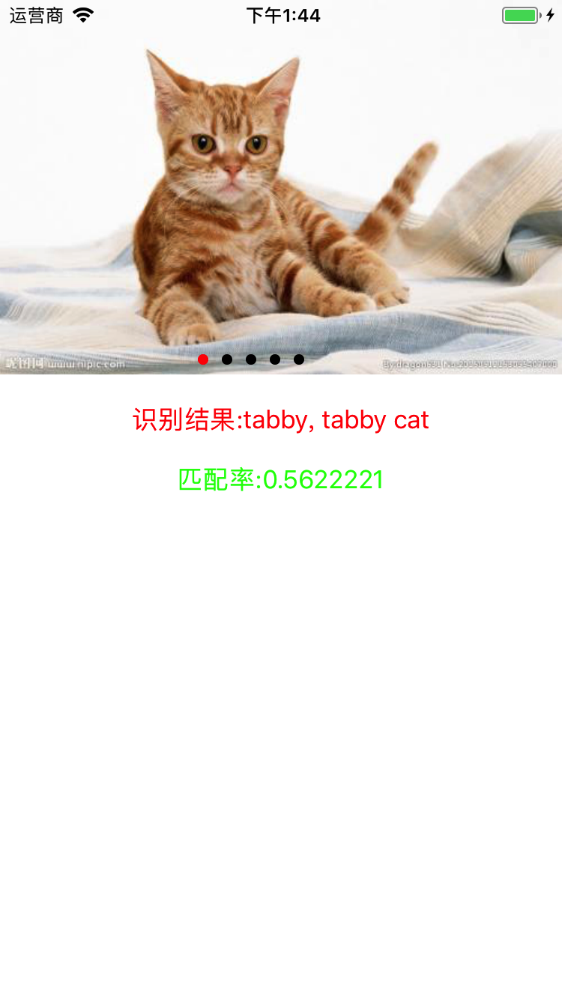
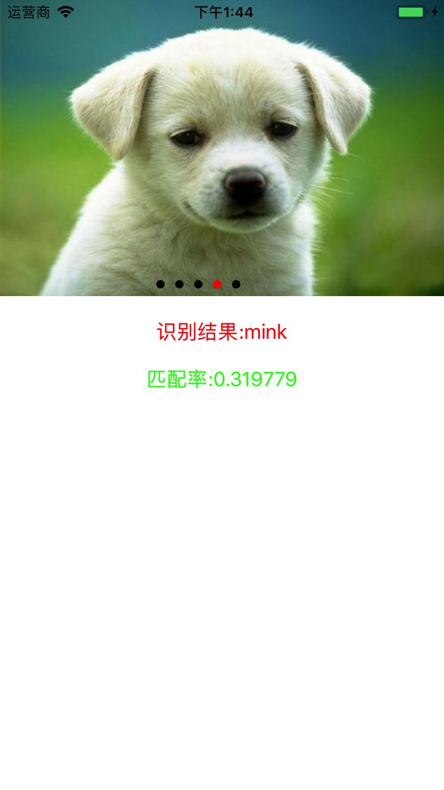
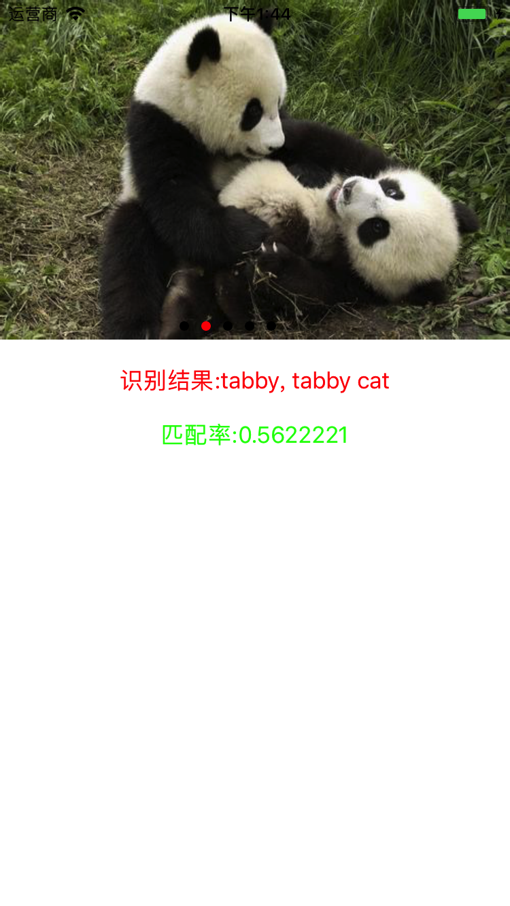

# CoreML_Resnet50

### Download Core ML Model

[Resnet50.mlmodel下载地址](https://developer.apple.com/machine-learning/)

### 导入头文件
<pre>
 #import < CoreML/CoreML.h>
 #import < Vision/Vision.h>
 #import "Resnet50.h"
</pre>

### 添加UIScrollView和UIPageControl

<pre>
self.scrollView = [[UIScrollView alloc]initWithFrame:CGRectMake(0, 0, viewWidth, 250)];
    self.scrollView.delegate = self;
    self.scrollView.bounces = YES;
    self.scrollView.contentSize = CGSizeMake(5 * viewWidth, 250);
    self.scrollView.pagingEnabled = YES;
    self.scrollView.showsHorizontalScrollIndicator = NO;
    [self.view addSubview:self.scrollView];
    
    self.pageControl = [[UIPageControl alloc]init];
    [self.pageControl setCenter:CGPointMake(viewWidth / 2 - 20, 250 - 10)];
    self.pageControl.numberOfPages = 5;
    self.pageControl.pageIndicatorTintColor = [UIColor blackColor];
    self.pageControl.currentPageIndicatorTintColor = [UIColor redColor];
    for (int i = 0; i < 5; i ++) {
        UIImageView * imageView = [[UIImageView alloc]initWithFrame:CGRectMake(i * viewWidth, 0, viewWidth, 250)];
        imageView.image = [UIImage imageNamed:[NSString stringWithFormat:@"%d.jpg",i + 1]];
        [self.scrollView addSubview:imageView];
    }
    
    [self.view addSubview:self.pageControl];
 </pre>
 
#### 滚动到开头或末尾

 <pre>
if (scrollView.contentOffset.x > 4 * viewWidth) 
{
        self.scrollView.contentOffset = CGPointMake(0, 0);
    }else if (scrollView.contentOffset.x < 0){
        self.scrollView.contentOffset = CGPointMake(4 * viewWidth, 0);
 }
 </pre> 
 
#### 滚动结束后识别图片

 <pre>
  self.currentImage =[UIImage imageNamed:[NSString stringWithFormat:@"%d.jpg",(int)(self.pageControl.currentPage)]];
   [self openResnet50];
 </pre>
 
### 图片识别

  1. 创建Resnet对象，加载CoreMLModel

  <pre>
  Resnet50 *resnetModel = [[Resnet50 alloc] init];
  VNCoreMLModel * vnCoreModel = [VNCoreMLModel modelForMLModel:resnetModel.model error:nil];
  </pre>
  
  2. 创建Vision请求，带有completion handle

  <pre>
   VNCoreMLRequest * vnCoreMlRequest = [[VNCoreMLRequest alloc] initWithModel:vnCoreModel completionHandler:^(VNRequest * _Nonnull request, NSError * _Nullable error) {
        CGFloat confidence = 0.0f;
        VNClassificationObservation * tempClassification = nil;
        for (VNClassificationObservation *classification in request.results) {
            if (classification.confidence > confidence) {
                confidence = classification.confidence;
                tempClassification = classification;
            }
        }        
   }];
  </pre>
  
  3. VNClassificationObservation对象两个属性
     * identifier：识别对象 
     * confidence：识别率
  4. 发送图片识别请求

  <pre>
   dispatch_after(dispatch_time(DISPATCH_TIME_NOW, (int64_t)(0 * NSEC_PER_SEC)), dispatch_get_main_queue(), ^{
       VNImageRequestHandler * vnImageRequestHandler = [[VNImageRequestHandler alloc] initWithCGImage:image.CGImage options:nil];   
        NSError *error = nil;
        [vnImageRequestHandler performRequests:@[vnCoreMlRequest] error:&error]; 
        if (error) {
            NSLog(@"%@",error.localizedDescription);
        }
    });
  </pre>
  
  5. 回调在主线程更新UI

  <pre>
  dispatch_after(dispatch_time(DISPATCH_TIME_NOW, (int64_t)(0 * NSEC_PER_SEC)), dispatch_get_main_queue(), ^{
            self.resultLable.text = [NSString stringWithFormat:@"识别结果:%@",tempClassification.identifier];
            self.confidenceLabel.text = [NSString stringWithFormat:@"匹配率:%@",@(tempClassification.confidence)];
        });
  </pre>

